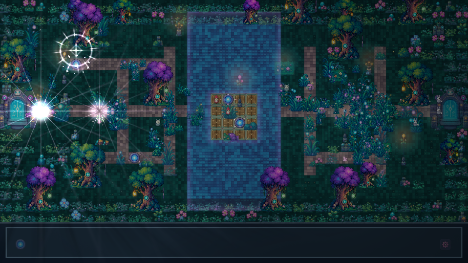

# Relay Moth Forest

**Relay Moth Forest** is a small, atmospheric exploration game about restoring a strange mechanical forest, gathering relay moths, helping robots, and moving through increasingly elaborate night-time environments.

This repository is the **original cute exploration game**. The later Steelmoth / cyberpunk-horror / WebGPU renderer experiments are a separate fork and are not the design direction of this project.

Current milestone: **Pretty Graphics Edition 4.14**.

## Quick start

### Windows

1. Download or clone the repository.
2. Keep the repository structure intact.
3. Run \`0Play.cmd\`.
4. The launcher starts the local Python server and opens the game in your browser.

The launcher requires **Python 3** and a browser with **WebGL2** support.

### Manual start

\`\`\`text
python relay_moth_server.py
\`\`\`

Then open the localhost URL printed by the server.

## Controls

| Action | Keyboard |
| --- | --- |
| Move | WASD / arrow keys |
| Pulse | Space |
| Gather | C |
| Formation command | F |
| Pause | P |
| Help | H |
| Level select | L |
| LUT mixer | U |
| Graphics / lighting | G |
| WYSIWYG editor | F2 |
| Colour lab | F3 |
| Advanced LUT editor | F4 |
| Raster export | F8 |
| Fullscreen | F11 |

The mouse is intentionally **not** a world-movement control. It is used for menus and for the F2 editor.

## Current game and rendering model

Relay Moth Forest renders a 640×360 logical scene with a 640×304 playable area and a 16 px gameplay grid.

The current renderer combines:

- a native-resolution static room layer;
- source-space normal/specular sprite materials;
- dynamic projected shadows and contact AO;
- SurfaceFX water and fine grass;
- FoliageFX rooted physical plants with coherent wind and actor interaction;
- globally ordered live HD sprites;
- bloom, lighting, LUT grading and semantic effect passes.

A key v4.14 design rule is that readable plants remain **whole sprites** during actor depth transitions. Earlier actor-shaped clipping and sliced-plant approaches were rejected because they produced visible flicker and fragments across robot faces.

See [Rendering](docs/RENDERING.md) and [Surface + Foliage](docs/SURFACE_AND_FOLIAGE.md).

## Followers and ambient life

Persistent robot followers form a **casual social group**, not a rigid formation. They use a broad comfort band, retarget infrequently, catch up independently, and recover independently when stuck. One blocked robot does not hold the rest of the group back.

Mini robots and woodland creatures are lightweight ambient actors. They do not own progression or collision authority.

See [Gameplay and simulation](docs/GAMEPLAY_AND_SIMULATION.md).

## WYSIWYG editor

Press **F2** to edit directly on the normal rendered game view.

The editor supports:

- palette painting with left click;
- right-click removal/suppression;
- object selection;
- area selection;
- drag/move;
- copy/paste;
- undo/redo;
- tiles, blockers, trees, decor, GrassFX, lamps and robots;
- relay moths, wildlife, mini robots and ambient/pattern objects;
- moving objective waypoint visuals without deleting story definitions;
- project save with automatic timestamped map backup.

In Quiet Nest, the large transparent moon/star swirl is selectable in **OBJECT** mode as \`nest:swirl\`.

See [Editor](docs/EDITOR.md).

## Data authority

The game deliberately keeps content in external JSON rather than burying it in code:

- \`relay_moth_maps.json\` — room geometry, authored visual placement and editor fields;
- \`relay_moth_story.json\` — room/story/objective progression;
- \`relay_moth_pixel_luts.json\` — semantic colour/LUT data;
- \`relay_moth_effects.json\` — effect presets;
- \`hd_remake_atlas.json\` — sprite regions, roles and material metadata.

See [Data formats and authority](docs/DATA_FORMATS.md).

## Sprite and material authoring

Runtime HD sprites use coordinate-matched colour, height, source-space normal and specular resources.

The runtime GPU paths use **colour + normal + specular**. The height atlas remains an authoring/inspection artifact. Static and live decoration use the same material contract so split trees and foreground clips do not change lighting at their seams.

See [Asset pipeline](docs/ASSET_PIPELINE.md).

## Validation

Run:

\`\`\`text
python self_test.py
\`\`\`

Authoring and test dependencies:

\`\`\`text
python -m pip install -r tools/requirements-authoring.txt
\`\`\`

The current test suite includes movement/collision invariants, bridge progression, follower recovery, editor persistence, strict sprite/material alpha checks, exact tree reconstruction, shader compilation, real GLES rendered-pixel tests and native Chromium WebGL2 integration where the required browser tooling is available.

The v4.14 validation was performed under Linux software-rendered Chromium/GLES. It is strong renderer evidence, but it is **not** a Windows/Firefox hardware-performance certification.

See [Testing and validation](docs/TESTING.md).

## Modding guide

For user-facing customisation—story/dialogue, maps, default settings, LUTs, effects, wildlife, moths and editor workflows—see the **[Relay Moth Forest Modding Guide](https://github.com/techrote/Relay-Moth-Forest/wiki)**.

The Wiki is written from the modifier's perspective. The `docs/` directory remains the developer/implementation reference.

## Repository guide

Start with [docs/README.md](docs/README.md).

The detailed documentation is organised by concern rather than by release number:

- architecture and ownership;
- gameplay/simulation;
- rendering;
- SurfaceFX/FoliageFX;
- editor;
- data formats;
- asset pipeline;
- testing;
- development/release workflow;
- design history and rejected approaches.

The pre-reorganisation documentation has been preserved intact in **[docs/4.14 milestone archive](docs/4.14%20milestone%20archive/README.md)**. Release artefacts for the milestone remain under [milestones/v4.14](milestones/v4.14/).

## Preserving local edits

The in-game editor can write \`relay_moth_maps.json\` through the localhost server. Before replacing a working folder with another version, preserve:

- your edited \`relay_moth_maps.json\`;
- \`editor_backups/\`.

Do not overwrite a newer runtime atlas/material set with older generated sprite maps when carrying map edits forward.
